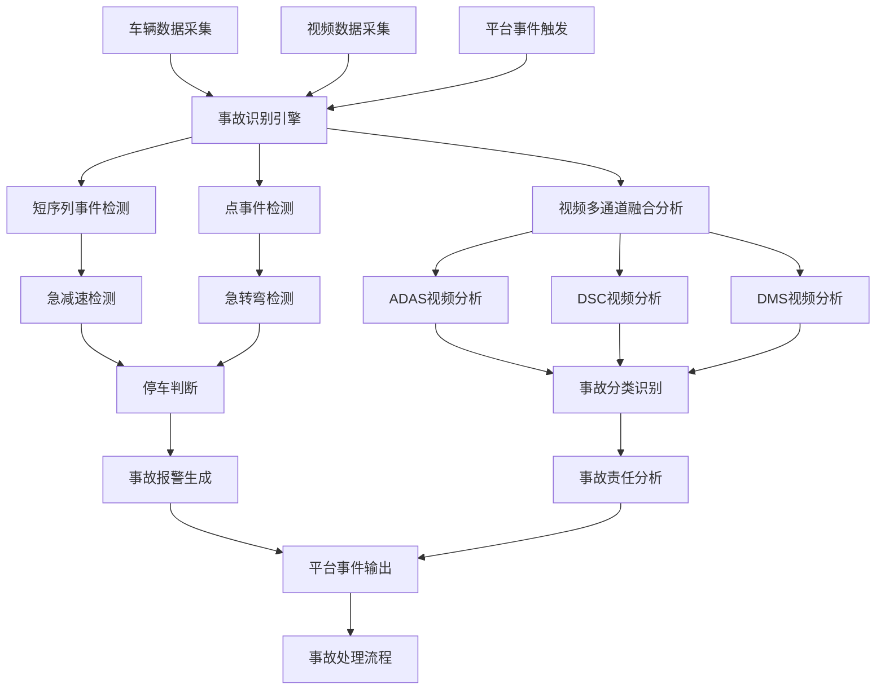
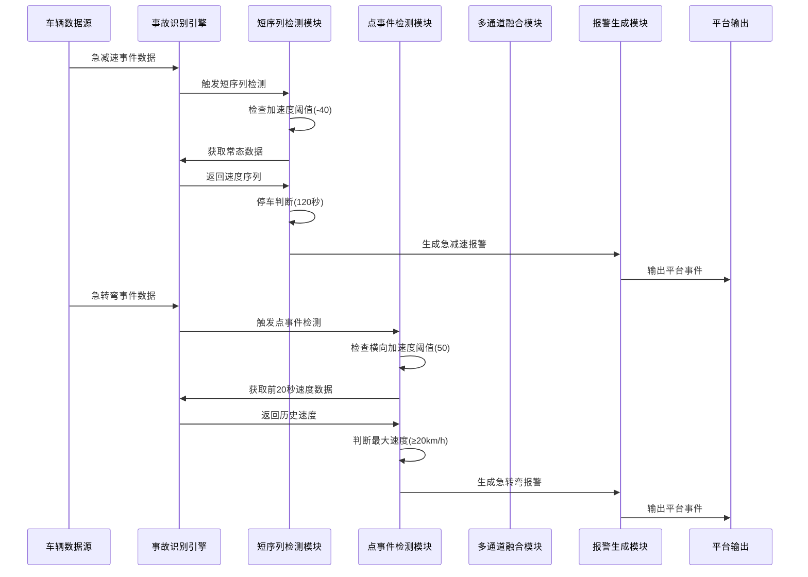

# 交通事故引擎概要设计

| 版本号 | 修订人 | 修订时间 | 修订说明 |
| --- | --- | --- | --- |
| V1.0 | 顾子贤 | 2024-01-XX | 交通事故引擎概要设计初版 |

## 1. 需求设计

### 1.1 用例分析



### 1.2 用例说明

| 用例名称 | 原因和动机 | 功能描述 | 优先级 | 前置条件 | 功能输入 | 功能输出 | 正常流程 | 异常流程 | 约束条件 | 责任人 |
|---------|-----------|----------|--------|----------|----------|----------|----------|----------|----------|--------|
| 急减速短序列事件检测 | 检测车辆急减速行为，识别潜在事故风险 | 基于加速度阈值检测急减速事件，结合停车判断生成事故报警 | 高 | 车辆正常运行，数据正常采集 | 车辆号、时间、加速度数据、速度数据 | 急减速事件标识、报警信息 | 1.接收急减速事件<br>2.检查加速度阈值<br>3.获取常态数据<br>4.判断停车状态<br>5.生成报警 | 1.数据缺失<br>2.阈值未达到<br>3.停车判断失败 | 加速度阈值-40，最低触发速度20km/h | 顾子贤 |
| 急转弯点事件检测 | 检测车辆急转弯行为，识别侧翻风险 | 基于横向加速度检测急转弯事件，结合速度判断生成事故报警 | 高 | 车辆正常运行，数据正常采集 | 车辆号、时间、横向加速度、速度数据 | 急转弯事件标识、报警信息 | 1.接收急转弯事件<br>2.检查横向加速度阈值<br>3.获取历史速度数据<br>4.判断速度条件<br>5.生成报警 | 1.数据缺失<br>2.阈值未达到<br>3.速度条件不满足 | 横向加速度阈值50，最低触发速度20km/h | 顾子贤 |
| 多通道视频融合分析 | 通过多通道视频提高事故识别准确性 | 融合ADAS、DSC、DMS视频进行事故分类识别 | 中 | 多通道视频数据可用 | ADAS视频、DSC视频、DMS视频 | 事故分类结果、置信度 | 1.接收多通道视频<br>2.特征提取<br>3.特征融合<br>4.分类识别<br>5.输出结果 | 1.视频损坏<br>2.通道缺失<br>3.特征提取失败 | 支持SwinTransformer3D和ConvNext3D模型 | 顾子贤 |
| 停车状态判断 | 判断车辆是否真正停车，避免误报 | 基于速度序列判断车辆停车状态 | 高 | 速度数据连续可用 | 速度序列、时间序列 | 停车状态、停车时间点 | 1.接收速度序列<br>2.逐点检查速度<br>3.累计停车时间<br>4.判断停车条件 | 1.数据中断<br>2.速度波动<br>3.等待超时 | 停车时间120秒，等待时间20秒 | 顾子贤 |

## 2. 功能设计

### 2.1 时序图



### 2.2 关键流程/业务说明

#### 2.2.1 主要功能
1. **短序列事件检测**：基于急减速短序列事件，检测加速度阈值-40，结合停车判断确认事故
2. **点事件检测**：基于急转弯点事件，检测横向加速度阈值50，结合前20秒最大速度判断
3. **多通道视频融合**：融合ADAS、DSC、DMS视频通道，使用深度学习模型进行事故分类
4. **停车状态判断**：基于速度序列判断停车状态，停车确认时间120秒，等待超时时间20秒

#### 2.2.2 异常场景
1. **数据异常**：常态数据缺失或延迟、视频数据损坏、事件数据格式错误
2. **阈值异常**：加速度未达到危险阈值、速度未达到最低触发条件、停车时间不足
3. **系统异常**：模型推理失败、数据库连接异常、内存不足

### 2.3 修改范围

| 服务 | 类型 | 页面/模块 | 修改项 |
|------|------|-----------|--------|
| 事故识别引擎 | 新增 | 核心引擎模块 | 实现事故识别主流程 |
| 短序列检测服务 | 新增 | impact_generate模块 | 急减速事件检测逻辑 |
| 点事件检测服务 | 新增 | rollover_generate模块 | 急转弯事件检测逻辑 |
| 视频融合服务 | 新增 | 多通道融合模块 | 视频特征融合分析 |
| 停车判断服务 | 新增 | stop_jud模块 | 停车状态判断逻辑 |

## 3. 接口设计

### 3.1 REST接口定义

#### 3.1.1 事故检测接口
- **路径**：`/api/v1/accident/detect`
- **方法**：POST
- **参数**：车辆号、事件类型、事件数据、时间戳
- **返回值**：检测结果、报警数据、置信度

#### 3.1.2 视频分析接口
- **路径**：`/api/v1/accident/video-analyze`
- **方法**：POST
- **参数**：车辆号、视频通道数据、时间戳
- **返回值**：事故分类、置信度、分析结果

### 3.2 错误码

| 错误码 | 错误信息 | 描述 |
|--------|----------|------|
| 200 | 成功 | 请求处理成功 |
| 400 | 参数错误 | 请求参数格式错误或缺失 |
| 500 | 内部错误 | 服务器内部错误 |
| 1001 | 数据缺失 | 必需的数据缺失 |
| 1002 | 阈值未达到 | 未达到事故检测阈值 |
| 1003 | 停车判断失败 | 停车状态判断失败 |
| 1004 | 视频分析失败 | 视频分析处理失败 |

## 4. Topic消息

### 4.1 消息输入

| Topic名称 | 消息内容 | 描述 |
|-----------|----------|------|
| vehicle.event.impact | 急减速短序列事件数据 | 包含车辆号、时间、加速度等信息的急减速事件 |
| vehicle.event.rollover | 急转弯点事件数据 | 包含车辆号、时间、横向加速度等信息的急转弯事件 |
| vehicle.video.multi-channel | 多通道视频数据 | 包含ADAS、DSC、DMS视频路径或数据的事件 |
| vehicle.normal.data | 常态数据 | 包含车辆速度、加速度等常态运行数据 |

### 4.2 消息输出

| Topic名称 | 类型 | 消息内容 |
|-----------|------|----------|
| accident.alarm.impact | 新增 | 急减速事故报警消息 |
| accident.alarm.rollover | 新增 | 急转弯事故报警消息 |
| accident.analysis.video | 新增 | 视频分析结果消息 |
| accident.status.stop | 新增 | 停车状态更新消息 |

## 5. 数据库设计

### 5.1 MySQL表结构

#### 5.1.1 车辆事件表 (vehicle_events)
```sql
CREATE TABLE `vehicle_events` (
  `id` bigint(20) NOT NULL AUTO_INCREMENT COMMENT '主键ID',
  `vehicle_number` varchar(50) NOT NULL COMMENT '车辆号牌',
  `event_type` varchar(20) NOT NULL COMMENT '事件类型：impact_event, rollover_event',
  `event_code` varchar(50) NOT NULL COMMENT '事件编码',
  `start_time` bigint(20) NOT NULL COMMENT '事件开始时间(毫秒)',
  `end_time` bigint(20) DEFAULT NULL COMMENT '事件结束时间(毫秒)',
  `acc_x` int(11) DEFAULT NULL COMMENT 'X轴加速度(0.1m/s²)',
  `acc_y` int(11) DEFAULT NULL COMMENT 'Y轴加速度(0.1m/s²)',
  `start_speed` int(11) DEFAULT NULL COMMENT '起始速度(0.1km/h)',
  `end_speed` int(11) DEFAULT NULL COMMENT '结束速度(0.1km/h)',
  `duration` decimal(10,3) DEFAULT NULL COMMENT '持续时间(秒)',
  `max_speed_before` int(11) DEFAULT NULL COMMENT '事件前最大速度(0.1km/h)',
  `is_accident` tinyint(1) DEFAULT 0 COMMENT '是否为事故：0-否，1-是',
  `confidence` decimal(5,3) DEFAULT NULL COMMENT '置信度(0-1)',
  `status` tinyint(1) DEFAULT 0 COMMENT '处理状态：0-待处理，1-已处理，2-处理失败',
  `created_time` timestamp NOT NULL DEFAULT CURRENT_TIMESTAMP COMMENT '创建时间',
  `updated_time` timestamp NOT NULL DEFAULT CURRENT_TIMESTAMP ON UPDATE CURRENT_TIMESTAMP COMMENT '更新时间',
  PRIMARY KEY (`id`),
  KEY `idx_vehicle_time` (`vehicle_number`, `start_time`),
  KEY `idx_event_type` (`event_type`),
  KEY `idx_status` (`status`)
) ENGINE=InnoDB DEFAULT CHARSET=utf8mb4 COMMENT='车辆事件表';
```

#### 5.1.2 事故报警表 (accident_alarms)
```sql
CREATE TABLE `accident_alarms` (
  `id` bigint(20) NOT NULL AUTO_INCREMENT COMMENT '主键ID',
  `alarm_id` varchar(50) NOT NULL COMMENT '报警ID',
  `vehicle_number` varchar(50) NOT NULL COMMENT '车辆号牌',
  `alarm_type` varchar(20) NOT NULL COMMENT '报警类型：impact, rollover',
  `event_start_time` bigint(20) NOT NULL COMMENT '事件开始时间(毫秒)',
  `event_end_time` bigint(20) NOT NULL COMMENT '事件结束时间(毫秒)',
  `begin_speed` int(11) DEFAULT NULL COMMENT '开始速度(0.1km/h)',
  `end_speed` int(11) DEFAULT NULL COMMENT '结束速度(0.1km/h)',
  `acc_x` int(11) DEFAULT NULL COMMENT 'X轴加速度(0.1m/s²)',
  `acc_y` int(11) DEFAULT NULL COMMENT 'Y轴加速度(0.1m/s²)',
  `duration` decimal(10,3) NOT NULL COMMENT '持续时间(秒)',
  `max_speed_before` int(11) DEFAULT NULL COMMENT '事件前最大速度(0.1km/h)',
  `confidence` decimal(5,3) DEFAULT NULL COMMENT '置信度(0-1)',
  `alarm_status` tinyint(1) DEFAULT 0 COMMENT '报警状态：0-待确认，1-已确认，2-误报，3-已处理',
  `created_time` timestamp NOT NULL DEFAULT CURRENT_TIMESTAMP COMMENT '创建时间',
  `updated_time` timestamp NOT NULL DEFAULT CURRENT_TIMESTAMP ON UPDATE CURRENT_TIMESTAMP COMMENT '更新时间',
  PRIMARY KEY (`id`),
  UNIQUE KEY `uk_alarm_id` (`alarm_id`),
  KEY `idx_vehicle_time` (`vehicle_number`, `event_start_time`),
  KEY `idx_alarm_type` (`alarm_type`),
  KEY `idx_alarm_status` (`alarm_status`)
) ENGINE=InnoDB DEFAULT CHARSET=utf8mb4 COMMENT='事故报警表';
```

### 5.2 Redis设计

| Key | Value类型 | 描述 | TTL |
|-----|-----------|------|-----|
| `accident:config:thresholds` | Hash | 事故检测阈值配置 | 永久 |
| `accident:vehicle:{vehicle_number}:last_event` | String | 车辆最后事件时间 | 24小时 |
| `accident:vehicle:{vehicle_number}:stop_status` | Hash | 车辆停车状态 | 1小时 |
| `accident:alarm:{alarm_id}` | Hash | 报警详细信息 | 7天 |

## 6. 核心业务代码实现

### 6.1 代码影响范围

| 类绝对路径 | 类类型 | 修改类型 | 类用途 | 方法 | 方法能力描述 |
|------------|--------|----------|--------|------|-------------|
| com.accident.engine.AccidentDetectionEngine | 服务类 | 新增 | 事故检测引擎主服务 | detectAccident() | 接收事件数据，协调各模块进行事故检测 |
| com.accident.engine.ImpactEventDetector | 服务类 | 新增 | 急减速事件检测 | detectImpactEvent() | 检测急减速事件，判断是否达到事故阈值 |
| com.accident.engine.RolloverEventDetector | 服务类 | 新增 | 急转弯事件检测 | detectRolloverEvent() | 检测急转弯事件，判断是否达到事故阈值 |
| com.accident.engine.VideoFusionAnalyzer | 服务类 | 新增 | 视频多通道融合分析 | analyzeVideoChannels() | 融合多通道视频进行事故分类 |
| com.accident.engine.StopJudgmentService | 服务类 | 新增 | 停车状态判断 | judgeStopStatus() | 基于速度序列判断车辆停车状态 |

### 6.2 核心方法定义

```java
@Service
public class AccidentDetectionEngine {
    
    @Autowired
    private ImpactEventDetector impactEventDetector;
    
    @Autowired
    private RolloverEventDetector rolloverEventDetector;
    
    @Autowired
    private VideoFusionAnalyzer videoFusionAnalyzer;
    
    /**
     * 检测事故
     * @param event 车辆事件数据
     * @return 事故检测结果
     */
    public AccidentDetectionResult detectAccident(VehicleEvent event) {
        try {
            AccidentDetectionResult result = new AccidentDetectionResult();
            
            // 根据事件类型选择检测器
            switch (event.getEventType()) {
                case "impact_event":
                    result = impactEventDetector.detectImpactEvent(event);
                    break;
                case "rollover_event":
                    result = rolloverEventDetector.detectRolloverEvent(event);
                    break;
                default:
                    result.setSuccess(false);
                    result.setMessage("不支持的事件类型: " + event.getEventType());
                    break;
            }
            
            return result;
        } catch (Exception e) {
            log.error("事故检测异常", e);
            return AccidentDetectionResult.error("事故检测异常: " + e.getMessage());
        }
    }
}
```

## 7. 验证方案

### 7.1 验证方案表格

| 场景 | 步骤 | 预期结果 |
|------|------|----------|
| 急减速事件检测-正常 | 1. 输入急减速事件数据(acc_x=-50)<br>2. 系统检查加速度阈值<br>3. 获取常态数据<br>4. 执行停车判断<br>5. 检查速度条件 | 成功生成impact_event类型报警，置信度>0.8 |
| 急转弯事件检测-正常 | 1. 输入急转弯事件数据(acc_y=60)<br>2. 系统检查横向加速度阈值<br>3. 获取前20秒速度数据<br>4. 检查最大速度条件<br>5. 生成报警 | 成功生成rollover_event类型报警，置信度>0.8 |
| 数据缺失异常 | 1. 输入缺失关键字段的事件数据<br>2. 系统尝试处理 | 返回错误信息"数据缺失"，不生成报警 |
| 阈值未达到异常 | 1. 输入加速度为-20的事件数据<br>2. 系统检查阈值 | 返回"未达到事故阈值"，不生成报警 |

## 8. 系统测试方案

### 8.1 测试用例设计

| 测试用例ID | 测试场景 | 前置条件 | 测试步骤 | 预期结果 | 优先级 |
|------------|----------|----------|----------|----------|--------|
| TC001 | 急减速事件检测-正常流程 | 系统正常运行，数据正常 | 1.发送急减速事件(acc_x=-50)<br>2.验证数据接收<br>3.检查阈值判断<br>4.获取常态数据<br>5.执行停车判断<br>6.生成报警 | 成功生成impact_event报警，置信度>0.8 | 高 |
| TC002 | 急转弯事件检测-正常流程 | 系统正常运行，数据正常 | 1.发送急转弯事件(acc_y=60)<br>2.验证数据接收<br>3.检查横向加速度阈值<br>4.获取历史速度数据<br>5.检查速度条件<br>6.生成报警 | 成功生成rollover_event报警，置信度>0.8 | 高 |
| TC003 | 视频多通道融合-正常流程 | 系统正常运行，视频数据可用 | 1.发送多通道视频数据<br>2.执行特征提取<br>3.进行特征融合<br>4.执行分类识别<br>5.输出分析结果 | 成功输出事故分类结果，各通道分析正常 | 中 |

### 8.2 性能测试用例

| 测试用例ID | 测试场景 | 测试指标 | 测试方法 | 预期结果 | 优先级 |
|------------|----------|----------|----------|----------|--------|
| PT001 | 并发处理能力 | 响应时间、吞吐量 | 100个并发请求，持续5分钟 | 平均响应时间<2秒，吞吐量>50TPS | 高 |
| PT002 | 大数据量处理 | 处理时间、内存使用 | 1000个速度点的停车判断 | 处理时间<1秒，内存使用<500MB | 中 |

## 9. 总结

本设计文档详细描述了交通事故引擎的完整设计方案，包括需求分析、功能设计、接口设计、数据库设计、代码实现、验证方案和测试方案。系统采用模块化设计，支持急减速和急转弯事件检测，以及多通道视频融合分析，能够有效识别交通事故并生成相应报警。

### 9.1 技术特点
- 基于阈值检测的实时事故识别
- 多通道视频融合提高识别准确性
- 停车状态判断避免误报
- 完整的异常处理机制
- 高性能的并发处理能力

### 9.2 部署建议
- 建议使用微服务架构部署
- 数据库采用主从复制提高可用性
- 使用Redis集群提高缓存性能
- 建议配置监控和告警系统

---

**设计文档已完成，请确认：设计文档是否合理？**
